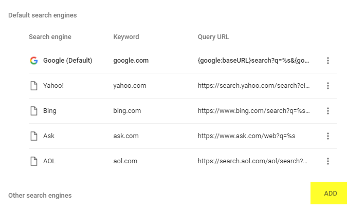
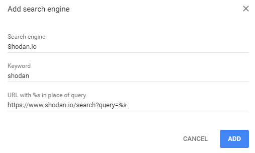

# Awesome Chrome Search Engines 

Google Chrome's custom search engines allows you to search any website from the address bar by typing a keyword, tab, and then your search. The hope is to organize these searches in the awesome list format.

## Setup

First, go to Chrome's main settings page and navigate to the Search Engines section.

Add a new search engine

Fill in the fields. The keyword is what you will type before pressing tab.

## Cybersecurity

* [Censys](https://censys.io/) - Search devices on the internet `https://censys.io/ipv4?q=%s`
* [CVE Details](https://www.cvedetails.com/) - Get details on a specific CVE ID `https://www.cvedetails.com/cve/%s`
* [Reddit](https://github.com/pushshift/api) - Search a Reddit user's posts (including deleted) `https://api.pushshift.io/reddit/search/submission/?author=%s`
* [Shodan](https://shodan.io) - Search devices on the internet `https://www.shodan.io/search?query=%s`
* [VirusTotal](https://www.virustotal.com/) - Analyze suspicious URLs, domains, or files `https://www.virustotal.com/#/search/%s`
* [Whois Lookup](https://whois.domaintools.com/) `http://whois.domaintools.com/%s`
* [ZoomEye](https://www.zoomeye.org/) - A cyberspace search engine `https://www.zoomeye.org/searchResult?q=%s`

## Technology

* [HTTP Status Codes](https://developer.mozilla.org/en-US/docs/Web/HTTP/Status/) - Get details on a specific HTTP response code `https://developer.mozilla.org/en-US/docs/Web/HTTP/Status/%s`

## Internet

* [Twitter](https://twitter.com/) - Search Twitter `https://twitter.com/search?q=%s`

## Other

* [AllRecipes](https://www.allrecipes.com) - Search for recipes `https://www.allrecipes.com/search/results/?wt=%s`
